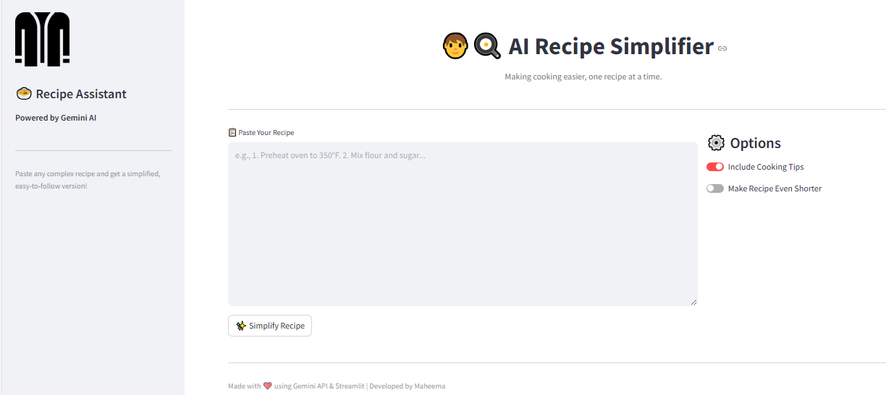

# 🧑‍🍳 AI Recipe Simplifier

Welcome to the **AI Recipe Simplifier**, a smart web app that uses Google's **Gemini AI** to turn long, complex recipes into easy-to-follow steps — perfect for beginners and busy cooks!



---

## ✨ Features

- 📝 **Paste Any Recipe** – Long, complex, handwritten, or copied from a website.
- 🤖 **Simplified Instructions** – Clear, short, step-by-step version powered by Gemini AI.
- ⚙️ **Customization Options**
  - Add basic cooking tips
  - Make the recipe even shorter
- 🌐 Built with **Streamlit** and **Google Gemini API**

---

## 🚀 Demo

Try the app locally:


---

## 🛠️ Installation

1. **Clone the repository**:
   ```bash
   git clone https://github.com/your-username/ai-recipe-simplifier.git
   cd ai-recipe-simplifier
